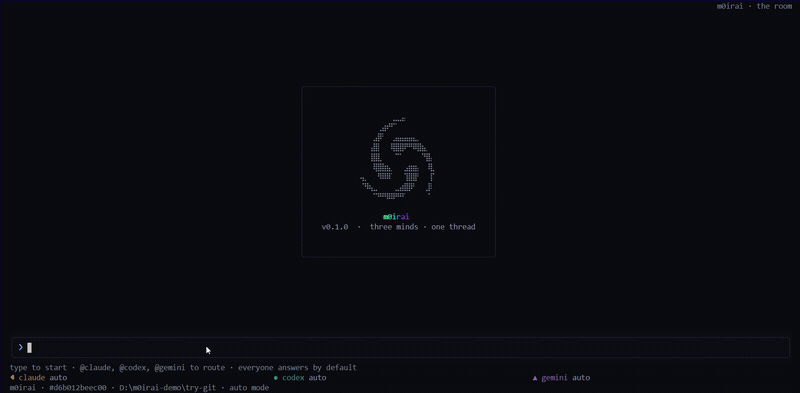

# m0irai

**Three of the best coding agents in the world, in one terminal, working the same repository at the same time.**

You already use Claude, Codex and Gemini. But you use them one at a time — switching terminals, copy-pasting context from one to the next, re-explaining what you just told the other, translating each one's answer into the next one's prompt. You are the message bus. m0irai deletes that job.

It's one room. You talk once. Claude, Codex and Gemini all hear it, each does the part it's actually best at, and their work is merged into a single answer — not three tabs you have to reconcile yourself.

**Watch the full demo:** [90-second walkthrough](https://github.com/CodeZer0-vibe/m0irai/releases/download/v0.1.0-preview/M0irai.mp4)

---

## Why three, not one

Because one is never enough, and we measured it. In our own coverage test (codename NEON SERPENT), **no single model got past 73% of the target. All three together hit 100%** — for about two dollars. A single-agent tool throws away the 27% that only one of the models would have caught. m0irai keeps all of it.

The point isn't a race. It's a division of labour where each model plays its real strength:

- **Claude** — architecture, edge cases, and the synthesis: it's the one that reads all three streams and merges them into one artifact.
- **Codex** — the builder. Implementation precision, dependency and API rigour, the actual code.
- **Gemini** — the researcher. The only one with live web grounding and vision: world research, fact-checking, current-API verification, competitor scans.

Their outputs are combined into one document with every claim attributed to who made it and the evidence behind it. Where two agents disagree on the same question, the disagreement is surfaced as a signal to investigate — never silently voted away.

## How it works

- **The chat is the whole interface.** No orchestrator to configure. Type `@codex do X`, `@gemini research Y`, `/council Z`, or just a normal sentence and it's routed to the right agent.
- **It reads the job from your words.** Say "quick mvp" and it runs light; say "ship it, production" and the gates get strict. It shows you the pick and you can override in one word.
- **The builder can push back.** An agent that thinks the plan is wrong stops and escalates with file-and-line evidence, instead of faithfully building the wrong thing — the failure mode that kills most single-orchestrator setups.
- **Nothing is "done" because an agent said so.** Work is checked by gates and a cross-family review (whoever built it is off its own review), and every state change is written to an evidence ledger you can read back.

## Under the hood

A Rust terminal room (forked from xAI's open-source grok-build) renders the shared floor; a TypeScript host runs the agents as real processes and bridges them over the Agent Client Protocol, so any ACP-capable CLI can join. Durable but not distributed: one embedded workflow engine, one SQLite evidence ledger, localhost only — crash-recovery and a full audit trail without the cluster tax.

**Stack:** Rust (terminal UI) · TypeScript (host) · Agent Client Protocol · Temporal (durable execution) · SQLite evidence ledger · bring-your-own agents

> Work in progress, open source, public release in preparation. The Rust room is a fork of xAI's grok-build (Apache-2.0) — see `LICENSE` and `NOTICE`.

## Status

- **Working:** the room, the chat dispatch surface (`@agent` / `@all` / `/council`), the multi-agent bridging, cross-family review, the council synthesis, the SQLite memory, and the gates.
- **Next:** the full greenfield pipeline (intent → research → spec → plan → build), the auto mode dials, and the public release build.
