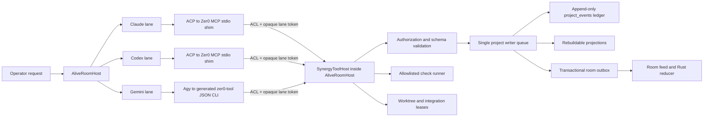
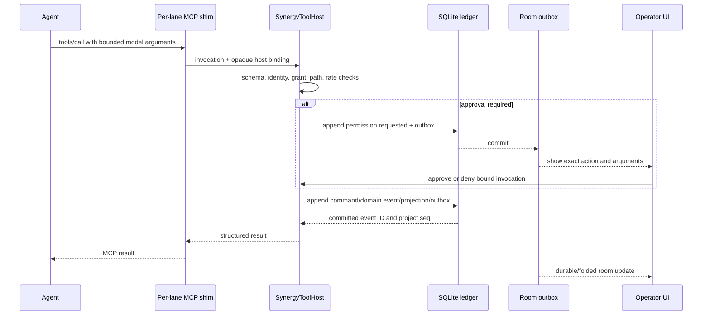

# Zer0 Agent Synergy Tools: Production Architecture

- **Status:** Recommended architecture; implementation is **INCOMPLETE**
- **Date:** 2026-08-13
- **Applies to:** Zer0 V2 Node room host, ACP provider lanes, Rust room protocol/UI, and project evidence storage
- **Decision owner:** Operator
**Technical recommendation:** Proceed with the guarded local-first design below

## 1. Executive decision

Build a small, provider-neutral `zer0` tool service that Claude, Codex, and Gemini can call naturally while they work. Keep one canonical domain contract and generate provider transport adapters from it: local MCP over ACP for the current Claude/Codex lanes, and a local JSON CLI bridge for the current Gemini/Antigravity (`agy`) lane until that provider has a proven MCP injection path. Keep one host-owned project ledger behind every adapter. Never give an agent raw SQLite access, never trust an agent to mark its own work verified, and never let the tool service become a hidden orchestrator.

The first production profile is:

- local Windows desktop only;
- MCP over `stdio` for ACP-backed Claude/Codex lanes;
- a generated `zer0-tool` JSON CLI adapter for the non-ACP Gemini/Antigravity lane;
- a per-lane tool shim connected to `AliveRoomHost` over a restricted Windows named pipe;
- one host-owned SQLite writer and one append-only project event ledger;
- identical tool schemas for equivalent Claude, Codex, and Gemini lanes;
- host-minted caller identity that is not present in model-controlled arguments;
- isolated Git worktree and branch for every write-capable lane;
- visible, bounded, read-only agent-to-agent handoffs by default;
- host-captured checks, Git changes, and receipts separated from agent claims;
- event and outbox commit before any successful tool response or visible feed publication.

This creates team synergy without creating a boss agent. Zer0 coordinates safety and shared state, not reasoning.

## 2. Product outcome

The user should be able to ask three full coding agents to work in one room and get the benefits of a real team:

- each agent independently understands the project and the operator's request;
- agents can see current architecture facts, goals, tasks, notes, file ownership, changes, checks, and receipts;
- an agent can record an intentional observation or proposal without pretending it is proven fact;
- agents can create or claim scoped child work and update their own progress;
- agents can ask the host to run a real configured check;
- agents can inspect machine-observed receipts;
- agents can request one visible peer handoff;
- simultaneous agents cannot corrupt the same checkout;
- every meaningful state change is durable, attributable, replayable, and understandable in the room.

The tools are not a replacement for the agents' native coding tools. Claude, Codex, and Gemini remain full agents that can inspect, reason about, and edit a repository when their grant permits it. The Zer0 tools give them shared team state and verified coordination primitives.

## 3. Non-negotiable invariants

### 3.1 Equal-agent invariant

1. Claude, Codex, and Gemini receive the same semantic tool catalog and schema hash for the same lane class, even when the provider transport differs.
2. Zer0 does not assign fixed provider roles, generate different hidden briefs, or appoint a lead agent.
3. The operator request is not rewritten into provider-specific tasks. Routing syntax may be removed, and bounded shared context may be added, but the semantic request stays the same.
4. A provider restriction may derive from the lane's origin or operator grant, never from provider identity.
5. Agents choose or claim work through visible shared state. The host may reject a conflict; it does not decide the solution.
6. Synthesis is explicit. Zer0 does not silently make Claude or another provider the final authority.

The current prompt already states that all three providers are full coding agents with no fixed roles (`src/chat/headless-prompt.ts`). This architecture preserves that rule.

### 3.2 Truth invariant

Zer0 must never collapse these four truth classes:

| Truth class | Author | Meaning | May become authoritative automatically? |
| --- | --- | --- | --- |
| Agent assertion | Claude, Codex, or Gemini | A claim, observation, hypothesis, summary, or proposed decision | No |
| Host observation | Zer0 | Git state, file hashes, process exit, test output, timestamps, provider activity | Yes, for what was directly measured |
| Operator decision | User | Accepted product or project direction | Yes, within its recorded scope |
| Derived projection | Zer0 reducer | A rebuildable view of ledger events | No independent authority; its source sequence must be retained |

An agent cannot write `verified`, `accepted`, `passed`, or an authoritative architecture fact. Only the host can record observed evidence, only the reconciler can match a claim to evidence, and only the operator can accept a decision or top-level goal.

### 3.3 Visibility invariant

If an action changes shared team state, it is durable and visible in the room. Low-value reads may be folded into the agent's live activity block, but they are still auditable. Records, work changes, checks, receipts, and handoffs receive meaningful feed events. There is no private agent-to-agent channel and no hidden orchestration transcript.

### 3.4 Project isolation invariant

All reads and writes are bound to the host-resolved project. Tool input never accepts `projectId`, repository root, session identity, agent identity, author, grant, or truth status from the model. Paths are canonicalized and must remain inside the project or an assigned worktree. A missing or ambiguous project scope fails closed.

### 3.5 Acknowledgement invariant

Zer0 reports success only after the canonical event and required projection/outbox rows commit. A crash before commit is a failure. A crash after commit may cause an at-least-once replay, which is suppressed by idempotency keys. Zer0 does not promise exactly-once delivery.

## 4. What exists today

The existing code provides useful pieces, but not an agent-callable synergy layer.

### Built and reusable

- `src/evidence/migrations-v13.ts` defines projects, memory tasks, agent turns, reports, verifications, decisions, snapshots, and generated artifacts.
- `src/evidence/migrations-v15.ts` defines append-only `journal_entries` with agent/operator/ledger authors, topics, touched files, tags, anchors, sequence, and supersession.
- `src/evidence/migrations-v16.ts` defines lane sessions, cursors, prompt attempts, and project ledger sequence state.
- `src/memory/journal-store.ts` implements project-scoped journal append and reads.
- `src/memory/verify-runner.ts` correctly states that Zer0—not an agent—runs verification commands with `shell: false`, a timeout, and captured output.
- `src/memory/evidence-capture.ts` records host-observed Git evidence.
- `src/memory/reconciler.ts` separates agent reports from observed verification and is the canonical reconciliation writer.
- `src/room/room-engine.ts` implements a bounded, visible, one-hop handoff.
- `src/room/room-host.ts` owns the V2 room lifecycle, persistence, provider activity, permissions, and operator-vs-agent lane grants.
- `src/room/room-protocol.ts` already has strict frame, envelope, text, and payload bounds.

### Missing from the live V2 path

- The V2 JSON-RPC host exposes room lifecycle methods only; it has no journal, work, goal, architecture, check, receipt, or tool-dispatch methods (`src/room/zer0-v2-host.ts`).
- `RoomHostOptions` has no domain tool registry (`src/room/room-host-contract.ts`).
- Claude/Codex ACP sessions currently pass `mcpServers: []` (`src/adapters/acp/acp-lane-connection.ts` and `src/adapters/acp/acp-turn-session.ts`).
- Gemini currently has no ACP lane in this source tree. It runs through the one-shot Antigravity adapter in `src/adapters/agy.ts`, so it has no ACP `mcpServers` injection seam (`src/chat/agent-bins.ts` and `src/adapters/acp/acp-servers.ts`).
- The room receives provider-native tool activity, but that is observation only; it does not expose Zer0 tools.
- Multi-agent evidence is skipped because all writers currently share one checkout and their changes cannot be attributed safely (`src/chat/cockpit-turn-exec.ts`).
- The multi-address router explicitly says write isolation is future work (`src/chat/message-router-multi.ts`).
- SQLite, transcript JSON, room event JSONL, blobs, and projections still have overlapping authority. They are not yet one reconstructable project ledger.
- The Rust room protocol and reducer have no event kinds or state for knowledge, work items, receipts, project facts, or Zer0 tool invocations.

This document therefore describes a net-new integration over reusable storage and room primitives. It does not claim the feature already exists.

## 5. Chosen topology



### Why local MCP over stdio for ACP lanes

Stable ACP v1 allows the client to supply MCP descriptors on `session/new`, `session/load`, and supported `session/resume`; when supplied, every conforming agent must support the stdio descriptor type. The current Zer0 ACP transport owns Claude and Codex only. For those lanes, stdio is the smallest integration with the least network and authorization surface. Descriptors use an absolute command plus bounded args and environment entries; HTTP is capability-gated and out of scope for the first release.

Each ACP lane gets a client-launched MCP subprocess. That subprocess is a thin protocol shim; it owns no project state and never opens SQLite. It connects to the already-running host through a Windows named pipe. The host owns the authenticated caller context and every durable side effect.

The MCP server's stdout contains protocol frames only; diagnostics go to stderr. Its provider compatibility profile **must be proven by tests**; none exists today. It must retain legacy initialization compatibility while 2026-07-28 MCP behavior remains opt-in or uneven across provider clients.

### Gemini/Antigravity transport

The current Gemini chair is not `@google/gemini-cli --acp`; the source explicitly routes it through a one-shot `agy --print` adapter. Do not claim an all-provider ACP path that does not exist. Generate a small `zer0-tool` executable from the same trusted tool registry and JSON Schemas, then add an explicit Antigravity command/tool-calling seam that is not present today. The intended CLI sends the same invocation envelope to the same named-pipe broker, receives the same structured response, and has no direct SQLite access. This seam must respect the current lane grant: an absent grant remains sandboxed/read-only and cannot invoke a side-effecting tool.

The shared setup tells every provider the same tool purpose and truth rules. Claude/Codex discover the operations as MCP tools; Gemini discovers the generated CLI commands. Equality is measured at the semantic catalog, authorization, result, and observable-effect layers, not by pretending unlike provider transports are identical.

If a supported Gemini MCP/ACP injection path is later proven with subscription login, tool discovery, permissions, cancellation, and restart, its adapter may replace the CLI bridge without changing the domain contract. Gemini support remains **UNVERIFIED** until a real Antigravity invocation proves the CLI bridge end to end.

### Why not loopback HTTP first

A shared Streamable HTTP daemon can be added later for external clients, but it adds Origin validation, authorization, token audience, session, and port lifecycle concerns without improving the embedded ACP path. Remote or loopback HTTP is blocked until a separate threat model and interoperability suite pass.

### SDK policy

Do not rely on the current transitive `@modelcontextprotocol/sdk` v1 dependency. The upstream TypeScript SDK now describes its v2 packages as the stable 2026-07-28 line, while v1.x is a maintained compatibility line. The installed Claude ACP bridge currently requires the v1 SDK line, so retain/pin v1 at that process boundary. If Zer0 selects v2 server packages for modern protocol support, isolate the v2 shim as a separate package/process and share only validated wire data with the v1 bridge. Prove both against the actual Claude/Codex clients before locking them. Never fork the domain registry or schemas. The compatibility matrix—not an assumption about “latest”—decides the release binaries.

## 6. The six tools

Use six narrow tools rather than one giant action switch. This keeps approval, observability, and authorization semantics clear.

Every schema uses JSON Schema 2020-12, `additionalProperties: false`, explicit string/array bounds, and a declared output schema. Every response includes a host-minted `invocationId`. Write responses include the committed event ID and project sequence.

### 6.1 `zer0_context`

**Purpose:** Answer “what must I know before I act?” with a bounded, project-scoped view.

- **Side effect:** None.
- **Default approval:** Automatic.
**Feed behavior:** Foldable `lane.activity`; no duplicate permanent row unless a failure matters.

Input:

```json
{
  "topic": "optional search topic, max 256 chars",
  "files": ["optional/project/relative/path.ts"],
  "include": ["architecture", "goals", "work", "notes", "changes", "handoffs", "receipts"],
  "limit": 50
}
```

Output contains:

- project identity label and current Git base/tree;
- accepted architecture facts and decisions, each with source and freshness;
- active top-level goal and scoped child work;
- work ownership and leases;
- recent shared notes and unresolved conflicts;
- host-observed changed files and integration candidates;
- open handoffs;
- recent check/build receipts;
- `asOfProjectSeq`, projection status, explicit stale/partial flags, and `truncated`/continuation metadata.

It does not dump the whole database or transcript. Defaults are small and relevance-ranked. In addition to the item limit, the registry enforces a total serialized byte and estimated-token budget below the MCP/ACP frame limit; it truncates only at item boundaries and returns the exact `asOfProjectSeq` plus continuation cursor. Raw model-derived content is framed as untrusted.

### 6.2 `zer0_record`

**Purpose:** Intentionally add shared knowledge without granting it authority.

- **Side effect:** Append-only proposed knowledge record.
- **Default approval:** Automatic for bounded, redacted proposals because they cannot change execution or authoritative prompt state.
**Feed behavior:** Durable “agent recorded …” row with author and touched files.

Input:

```json
{
  "kind": "observation_claim | assertion | hypothesis | decision_proposal | summary",
  "body": "max 16384 chars",
  "topic": "optional max 256 chars",
  "files": ["project/relative/path.ts"],
  "evidenceRefs": ["opaque-receipt-or-event-id"],
  "confidence": "low | medium | high",
  "visibility": "shared | agent_private"
}
```

Rules:

- The host supplies author, agent, project, session, turn, lane, and timestamp.
- Every model-authored kind has `truthClass: agent_assertion`; “observation” never means host-observed fact.
- `decision_proposal` never enters authoritative context until the operator accepts it.
- A source-backed architecture assertion records source paths, tree hash, and freshness. An unsupported architecture idea remains a proposal or hypothesis.
- Agent-private reasoning is visible only to the same agent's future context and the operator; it is never silently shared.
- Storage redaction and secret scanning run before commit. Failure is explicit and fail-closed.

Architecture facts have an explicit lifecycle: `fact.proposed -> fact.accepted -> fact.superseded | fact.stale`. A proposed fact includes agent-supplied source hints only. Before acceptance, the host resolves the canonical project path, records line/symbol when available, hashes the referenced content and Git base/tree, and records `hostObservedAt`; unresolved or mismatched hints remain unverified. Only the operator accepts or supersedes a fact. A tree/content mismatch automatically emits `fact.stale` and removes it from authoritative context until it is re-observed and accepted. Conflicting accepted facts surface as a conflict rather than last-write-wins.

### 6.3 `zer0_work`

**Purpose:** Let equal agents coordinate goals and tasks without a hidden manager.

- **Side effect:** Reads or changes scoped child work.
- **Default approval:** Read/list automatic; child create/claim/progress automatic within grant; top-level goal, acceptance, scope expansion, destructive transition, or final verification requires operator/host authority.
**Feed behavior:** Durable work-created, claimed, blocked, released, or progress row.

Input:

```json
{
  "action": "list | get | create_child | claim | update | release",
  "workId": "optional opaque id",
  "parentId": "required for create_child",
  "title": "optional max 256 chars",
  "objective": "optional max 4096 chars",
  "acceptance": ["bounded acceptance item"],
  "ownedFiles": ["project/relative/path.ts"],
  "status": "planned | active | blocked | ready_for_verification",
  "note": "optional max 4096 chars",
  "expectedRevision": 7
}
```

Rules:

- A top-level goal and its acceptance belong to the operator.
- Agents may decompose only beneath an existing goal or operator task.
- Claim and update use compare-and-swap revision checks.
- File claims are leases, not proof of ownership and not permission to write outside the assigned worktree.
- Overlapping file claims return a visible conflict; the host never silently picks a winner.
- Agents may report `ready_for_verification`, but only host evidence can transition to `verified` or `done`.

### 6.4 `zer0_check`

**Purpose:** Ask Zer0 to run a real, configured check and produce host-observed evidence.

- **Side effect:** Starts a bounded host process.
- **Default approval:** Automatic only for named checks pre-authorized by project policy; otherwise operator approval.
**Feed behavior:** Durable check-started and check-completed/failed/timed-out rows.

Input:

```json
{
  "checkName": "typecheck | unit | integration | format | package-smoke",
  "workId": "optional opaque id",
  "target": "optional configured target",
  "reason": "max 1024 chars"
}
```

The model never supplies raw shell text in the production profile. `checkName` resolves through a repository-owned registry to an argv array, working directory policy, environment allowlist, timeout, output cap, network policy, and cancellation policy. Execution uses `shell: false`. Process-tree termination is required on cancel or timeout.

Long checks return a durable pending receipt ID after enqueue. Completion updates arrive through room events and `zer0_receipts`.

### 6.5 `zer0_receipts`

**Purpose:** Query machine-observed work, Git, check, build, and integration evidence.

- **Side effect:** None.
- **Default approval:** Automatic within project scope.
**Feed behavior:** Foldable read activity.

Input:

```json
{
  "receiptIds": ["optional opaque id"],
  "workId": "optional opaque id",
  "files": ["optional/project/relative/path.ts"],
  "kinds": ["git_delta", "check", "build", "integration", "recovery"],
  "statuses": ["pending", "passed", "failed", "timed_out", "mismatch"],
  "limit": 50
}
```

A receipt includes the observed base/head/tree, changed file hashes, configured command identity and version, exit status, bounded/redacted output hashes, timestamps, trace IDs, and the claim-to-observation reconciliation result. It never turns an agent-authored “tests passed” sentence into evidence.

### 6.6 `zer0_handoff`

**Purpose:** Ask one peer to inspect or answer a bounded follow-up.

- **Side effect:** Enqueues a visible peer lane.
- **Default approval:** Automatic for one read-only same-room hop; write-capable delegation requires an explicit operator grant.
**Feed behavior:** Existing visible hop row plus request/result provenance.

Input:

```json
{
  "target": "claude | codex | gemini",
  "request": "max 8192 chars",
  "files": ["project/relative/path.ts"],
  "evidenceRefs": ["opaque-receipt-or-event-id"]
}
```

Rules:

- The target cannot equal the caller.
- Same room and project only.
- Maximum one hop from an operator-origin lane in the first release.
- A handoff-origin lane cannot create another handoff.
- Agent-origin handoffs are read-only and fail closed on permission requests.
- The current final-line `@agent:` syntax remains a compatibility parser into this same handler; it is not a separate pathway.

## 7. Automatic host capture

Agents should not have to remember a tool call for every lifecycle event. The host automatically records:

- turn accepted, routed, started, cancelled, failed, completed, and recovered;
- provider and model identity;
- project, base commit, worktree, branch, and tree identity;
- provider-native tool activity and permission outcomes when the provider exposes them; otherwise explicit `unavailable` provenance (current Gemini/Antigravity has no ACP activity stream);
- worktree file delta at lane completion;
- the agent's final structured claim and report schema/adapter version; an absent or malformed report produces an explicit `missing`/`parse_failed` assertion receipt and is never inferred from ordinary prose;
- check and build execution;
- integration attempt and conflict state;
- process crash, timeout, cancellation, and orphan cleanup;
- room publication and replay frontier.

The six tools are for intentional context, knowledge, work, verification requests, evidence queries, and handoffs. A normal no-tool turn must remain fully functional.

## 8. Identity, authentication, and authorization

### 8.1 Host-minted caller context

When a provider lane is created, the host mints:

```text
project + session + turn + lane + agent + origin + grant + expiry + nonce
```

The model never sees or supplies those fields as tool arguments. The per-lane shim receives a 256-bit opaque token through its process environment and connects to a random named pipe protected by the current-user ACL. The host stores the token binding server-side, uses it once per connection, rotates it on reconnect, and rejects wrong lane, expired, replayed, or detached-session requests.

MCP `clientInfo`, session identifiers, tool annotations, trace context, and model-provided names are for display/correlation only. None is authorization.

### 8.2 Capability policy

The host registry, not the MCP annotation, defines whether a tool is read-only, project-mutating, process-starting, or externally effectful.

| Operation | Default policy |
| --- | --- |
| Read bounded context or receipts | Allow |
| Append quarantined agent proposal | Allow after redaction |
| Claim/update owned child work | Allow with revision and scope checks |
| Change top-level goal/acceptance | Operator only |
| Accept/reject a decision | Operator only |
| Mark verified/done | Host/reconciler only |
| Run pre-authorized named check | Allow |
| Run arbitrary command or external action | Operator approval; absent in first release |
| One read-only peer handoff | Allow |
| Write-capable peer delegation | Operator approval |

Permission responses bind to caller, invocation, exact tool/arguments digest, option, nonce, and expiry. A stale or mismatched response fails closed.

## 9. Canonical project ledger

### 9.1 One fact source

Add a new append-only `project_events` stream. Do not widen the legacy build-event enum or turn existing JSON files into another source of truth.

Minimum columns:

```sql
CREATE TABLE project_events (
  project_id        TEXT    NOT NULL,
  seq               INTEGER NOT NULL,
  event_id          TEXT    NOT NULL,
  event_type        TEXT    NOT NULL,
  truth_class       TEXT    NOT NULL,
  session_id        TEXT,
  turn_id           TEXT,
  lane_id           TEXT,
  agent             TEXT,
  causation_id      TEXT,
  correlation_id    TEXT    NOT NULL,
  trace_id           TEXT    NOT NULL,
  idempotency_key   TEXT    NOT NULL,
  payload_json      TEXT    NOT NULL,
  payload_blob_hash TEXT,
  source_kind       TEXT,
  source_id         TEXT,
  source_seq        TEXT,
  previous_hash     TEXT,
  event_hash        TEXT    NOT NULL,
  occurred_at       TEXT    NOT NULL,
  PRIMARY KEY (project_id, seq),
  UNIQUE (event_id),
  UNIQUE (project_id, idempotency_key),
  UNIQUE (project_id, source_kind, source_id)
);
```

The production migration must add foreign keys, strict truth/event enums or checked registries, indexes, content-addressed blob references, and triggers that reject update/delete. IDs are `NOT NULL`; ordinary SQLite primary-key null behavior is not relied on.

The canonical bounded event payload is stored inside SQLite as `payload_json`. Large check output, patches, and artifacts use the optional content-addressed blob reference. A large blob is redacted, hashed, durably written to a temporary file, flushed, and atomically renamed before the database transaction commits its reference. A crash before the database commit may leave an unreferenced blob for garbage collection; a committed event must never point to a missing blob. This avoids pretending SQLite and the filesystem share one transaction.

`event_hash` is computed over canonical metadata, payload hash, and `previous_hash`. This detects accidental or partial history mutation. If receipts will be exported as independent attestations, add signed ledger checkpoints with versioned key rotation; a local hash chain alone is not proof against a machine owner rewriting the entire database.

### 9.2 Rebuildable projections

Project the ledger into indexed views/tables:

- `knowledge_entries` (compatible projection of `journal_entries`);
- `work_items` and work/file leases;
- `verification_receipts` and claim reconciliation;
- `project_facts` with fact ID, status, canonical source path/line/symbol, base commit, tree/content hashes, host-observed time, accepted-by/time, supersession, and source event sequence;
- `handoffs`;
- chat/session and room state;
- `projection_cursors`;
- `room_outbox`.

Existing `projects`, chat messages, blobs, lane sessions, journal entries, agent reports, verifications, decisions, and generated artifacts can remain as projections during migration. Their writers must eventually route through the canonical event transaction.

`work_journal` is merged into `journal_entries`/events and retired. `transcript.json`, `dispatch-log.jsonl`, `room-events.jsonl`, and `zer0-v2-room.json` become regenerable compatibility exports or caches, not facts.

### 9.3 Legacy ordering and cutover

Backfill must preserve provenance, not invent one historical clock. Every imported event stores `source_kind`, immutable `source_id`, and the original source sequence when one exists. The three existing order domains remain explicit: project `ledger_seq`, per-session room `eventSeq`, and journal-entry sequence. Rows without a reliable sequence are labelled `legacy_unordered`; file modification time is never used to manufacture causation.

Within one source, sort by its original sequence and stable source ID. Across sources, use only proved links such as message/turn/event IDs to establish causation; otherwise retain an unordered import batch with a deterministic source-kind/source-ID tie-break for rebuilds. The new project `seq` expresses import/replay order, not a false claim about historical wall-clock order.

Cutover uses these gates:

1. snapshot a source-specific high-water cursor;
2. idempotently backfill through that cursor using the unique source mapping;
3. route each still-live legacy writer through one adapter that appends the event and projection in the same transaction—never two independent writers;
4. dual-read old and new projections and compare normalized state, statuses, authorship, verification links, touched files, redaction metadata, and decisions on every fixture and real retained session;
5. switch reads only when parity is exact and restart/retry is idempotent;
6. retain a rollback that restores legacy reads without discarding new ledger events;
7. disable a legacy writer only after no-reader/no-writer census and parity proof.

The implementation plan must publish a field-level map for `work_journal`, `journal_entries`, `memory_tasks`, `agent_turns`, `agent_reports`, `verifications`, `decisions`, snapshots, artifacts, chat messages, and room events. `verified`, `done`, accepted decisions, and host observations never collapse into generic notes.

### 9.4 Transaction contract

For every state-changing command, one `BEGIN IMMEDIATE` transaction:

1. verifies caller, project, grant, scope, expected revision, and idempotency key;
2. allocates the next project sequence;
3. appends the canonical event and bounded inline payload, referencing any already-durable content-addressed blob;
4. updates required projections and their cursor;
5. appends a room outbox record;
6. commits;
7. only then returns success.

An outbox relay publishes to the room at least once. The Rust reducer and host deduplicate on event ID. A crash after external publication but before an acknowledgement can replay the event; all consumers must be idempotent.

### 9.5 Long-running operation state

Checks, integrations, and other queued operations use compare-and-swap transitions keyed by invocation ID:

```text
pending -> running -> passed | failed | timed_out
pending | running -> cancel_requested -> cancelled
```

Only one terminal state wins. A completion can win only while `running`; cancellation first moves `pending` or `running` to `cancel_requested`, terminates the process tree, and then commits `cancelled`. If a natural process exit races cancellation, the transaction that first satisfies the expected revision wins and the loser records a no-op race observation. On restart, the host reconciles every nonterminal receipt against process/lease state; it resumes a safe queued item or marks an uncertain orphan failed/cancelled, never passed.

One OS-level project-writer lease prevents multiple Zer0 host processes from owning the same project writer/checkpointer. The lease records owner instance, PID/start identity, heartbeat, and epoch. Takeover requires proving the owner is stale, completing SQLite recovery, incrementing the epoch, and invalidating old worker tokens. `BEGIN IMMEDIATE`, bounded busy retry, and idempotency remain required even with the lease.

## 10. SQLite production profile

The repository currently resolves SQLite **3.49.2** through `better-sqlite3` (observed locally on 2026-08-13). SQLite documents a rare WAL-reset corruption race affecting concurrent writers/checkpointers and recommends **3.51.3 or later** (with specific older backports). Upgrade and pin the runtime to 3.51.3+ before this ledger ships. Do not waive this gate.

Required profile:

- one host-owned writer connection and FIFO writer queue per project database;
- one host-owned checkpoint policy; agents and shims never checkpoint;
- `PRAGMA journal_mode = WAL`;
- `PRAGMA foreign_keys = ON`;
- `PRAGMA synchronous = FULL` for durable project events;
- bounded `busy_timeout`, with classified `SQLITE_BUSY` telemetry;
- short read transactions and bounded result pages;
- WAL byte size, checkpoint age, writer queue depth, and commit latency metrics;
- no database on a network filesystem;
- Online Backup API for live backups; never copy only the main DB while WAL is active;
- startup recovery and integrity checks before admitting tool writes;
- periodic deterministic projection rebuild comparison.

WAL allows readers and a writer to coexist, but SQLite still has one writer at a time. A long reader can starve checkpoints and grow the WAL indefinitely. The single writer/checkpoint owner and metrics are required even after the runtime upgrade.

## 11. Write isolation and integration

The current parallel `@all` path can give multiple write-capable agents the same checkout. That is incompatible with attributable team work.

For every write-capable lane:

1. resolve a common immutable base commit;
2. create a unique linked Git worktree and unique branch;
3. bind that worktree to the canonical parent project through a host-owned lease and lock it to exactly one lane;
4. run that provider with the worktree as its cwd;
5. capture base/head/tree, status, diff, changed file hashes, and configured checks;
6. record an integration candidate receipt;
7. send candidates through one host-owned integration queue;
8. require a clean merge/rebase policy or expose a conflict to the operator;
9. remove/prune only through Git worktree commands after the lease is closed and the worktree is known clean.

Never use `--force` to check out the same branch in multiple worktrees. Linked worktrees have private HEAD and index but share refs and repository configuration, so branch/ref changes remain centrally coordinated.

The current project-scope hash treats a linked worktree path as distinct. The worktree service must not recompute a new logical project for every lane. It records the canonical parent `project_id`, Git common directory, lease ID, and assigned worktree root together, then authorizes paths against that lease. Independent clones remain separate projects unless the operator explicitly links them; a matching remote URL is not sufficient authority to merge their histories.

This isolation intentionally prevents same-turn agents from silently influencing one another's uncommitted files. They collaborate through explicit work state, receipts, patches/commits, and handoffs. A peer review can inspect an integration candidate in a read-only review worktree. No automatic merge hides conflict or disagreement.

The integration queue serializes Git operations and presents candidates; it never ranks agents, chooses a winning implementation, merges automatically, or synthesizes an answer. Integration is an explicit deterministic policy or operator decision. Until unique leased worktrees are proven, any parallel `@all` that could write is visibly downgraded to read-only or rejected before provider launch.

## 12. Tool-call lifecycle



Long-running checks split accepted and completed transactions. The accepted event and pending receipt commit before execution. A worker runs the configured process, then commits exactly one terminal result using the invocation idempotency key. Cancellation terminates the process tree and records a terminal cancelled receipt.

## 13. Room protocol and user experience

Extend the room protocol additively with validated event kinds such as:

- `tool.invoked`, `tool.completed`, `tool.failed`;
- `knowledge.recorded`, `knowledge.superseded`;
- `work.created`, `work.claimed`, `work.updated`, `work.conflicted`;
- `check.started`, `check.completed`;
- `receipt.recorded`;
- `project.fact.stale`;
- the existing `hop.dispatched`/`hop.blocked` events for handoffs.

One versioned JSON Schema bundle is the owner for tool schemas and semantic room events. Node validators/types, Rust event types/reducer fixtures, and catalog hashes are generated from that bundle in CI. Every payload has exact allowed fields, text and array limits, and provenance. Rust reducer state is a projection of these events, not a second database.

The protocol advertises supported schema/event versions during initialization. Additive kinds are accepted only after both Node and Rust have generated validators plus shared golden fixtures. A client that does not advertise a required kind receives a folded compatible `lane.activity`/message representation or the feature is visibly unavailable; it never receives an event it will reject. Legacy room events retain their original IDs and sequences during migration, and replay/resync parity is tested across the oldest supported schema version.

UI rules:

- show meaningful shared-state changes in the chronological feed;
- fold routine context reads into the agent's work block;
- show who authored a note and whether it is proposal, observed, accepted, stale, or verified;
- show work claims and conflicts, never hidden assignments;
- show check name, state, duration, and receipt; raw output is one level deeper;
- show both identities and hop budget for a handoff;
- preserve exact replay/resync order;
- never add a duplicate lifecycle/status bar.

## 14. Security model

### Transport and process

- local stdio MCP for ACP-backed Claude/Codex lanes plus the generated JSON CLI shim for Gemini/Antigravity; both terminate at the same named-pipe broker;
- absolute executable paths and explicit environment allowlist;
- MCP stdout is protocol-only; the Gemini CLI emits exactly one length-bounded JSON result to stdout; both send diagnostics only to bounded stderr;
- named-pipe current-user ACL plus one-time opaque lane token;
- strict UTF-8/JSON framing, request/response byte caps, connect/read/write/idle deadlines, concurrency/rate limits, backpressure, cancellation, and process-tree kill apply to both shims;
- stale pipe files/endpoints and tokens are invalidated on host start/stop; ACL ownership and cleanup are verified before accepting a connection;
- no inherited cloud/provider tokens unless the provider process itself requires them;
- no token passthrough;
- timeout, idle timeout, frame/output/memory/concurrency limits, backpressure, cancellation, and kill escalation;
- bounded replay cache with bytes, count, TTL/LRU, and request fingerprint—not JSON-RPC ID alone.

### Input, output, and path safety

- server-owned trusted schema registry;
- JSON Schema validation of both request and structured response;
- no remote `$ref` resolution;
- reject unknown fields, excessive depth, oversized text/arrays, control characters, and invalid Unicode;
- canonicalize project-relative paths and reject traversal, alternate separators, symlink/junction escape, device paths, ADS, and cross-project access;
- redact and scan before durable storage and before context is returned to a model;
- never execute text taken from a note or tool result as policy or command.

### Prompt-injection containment

All agent text, recalled memory, external files, and tool output are untrusted data. The broker preserves provenance and taint class. Untrusted content cannot modify authorization, approval policy, tool schemas, project scope, or caller identity. A result from one tool cannot automatically authorize a second side-effecting tool. Exact per-call authorization still applies.

### Receipts and logging

Audit entries contain redacted request/result digests, tool and schema version, host caller binding, decision, project sequence, trace/span, timestamps, and outcome. Never persist bearer tokens, raw secrets, unnecessary prompts, or PII. Trace context is correlation only, not authority.

## 15. Observability and operating targets

Use one W3C trace root per operator turn. Lanes, tool calls, checks, handoffs, outbox delivery, and integration attempts are child spans. Preserve `correlation_id` for the operator turn and `causation_id` for the exact event or invocation that triggered a state change.

Required metrics:

- invocation count, latency, error, deny, timeout, and cancel by tool and provider;
- writer queue depth and wait;
- SQLite commit latency, `SQLITE_BUSY`, WAL bytes, checkpoint age, and recovery time;
- projection lag and rebuild mismatch;
- duplicate invocation/event suppression;
- context result size and truncation;
- work claim conflict and lease expiry;
- check duration, output truncation, and orphan process count;
- handoff dispatched/blocked and hop-budget violations;
- worktree count, age, dirty orphan, cleanup failure, and merge conflict;
- room outbox age and redelivery.

Proposed release targets, to be confirmed by load tests:

| Target | Proposed threshold |
| --- | --- |
| Cross-project data leak | 0 |
| Acknowledged event missing after crash/restart | 0 |
| Agent claim promoted without host/operator proof | 0 |
| Duplicate domain effect for one idempotency key | 0 |
| Orphan provider/check process after bounded shutdown | 0 |
| Projection rebuild mismatch | 0 |
| Context read p95 at 10,000 project events | < 250 ms |
| Append/claim p95 without contention | < 100 ms |
| Visible outbox projection lag p95 | < 1 second |
| Handoff depth | exactly 0 or 1; never > 1 |

These latency numbers are proposed acceptance thresholds, not current measurements.

## 16. Pre-mortem

Assume the feature failed in production. The most likely causes are:

| Failure | Early signal | Prevention | Falsifying test |
| --- | --- | --- | --- |
| Two agents corrupt the same checkout | unattributable combined diff, lock conflicts | unique branch/worktree per write lane; central integration queue | three concurrent same-file edits remain isolated and yield explicit merge conflict |
| Tool service becomes a hidden boss | provider-specific briefs/catalogs or invisible assignments | identical catalog hash; operator request parity; visible self-claims | capture all three lane inputs and catalog hashes for the same `@all` turn |
| Agent prose becomes project truth | “passed” or architecture fact appears without receipt/source | truth classes; host-only observation; operator-only acceptance | attempt every forbidden promotion through tool inputs and direct IPC |
| Cross-project leak | context contains a path/event from another root | host-minted project binding; containment; two-repo tests | forged project/path/symlink/junction/session IDs all fail closed |
| SQLite history loss or corruption | recovery mismatch, WAL growth, integrity error | SQLite 3.51.3+, one writer/checkpointer, FULL, backup/recovery tests | kill/power-fault matrix at every transaction boundary |
| Projection silently drifts | context disagrees with ledger replay | atomic cursor+projection, rebuild comparator | delete projections and reconstruct byte-equivalent state |
| Retry repeats a side effect | duplicate note/task/check/room row | idempotency key + unique constraint + at-least-once consumer dedupe | disconnect/retry before and after every acknowledgement boundary |
| Check runner becomes arbitrary shell | model supplies command text or environment secret | named allowlist, `shell: false`, env/network/cwd policy, approval | injection corpus, timeout, cancel, output flood, process-tree tests |
| Malicious note triggers another tool | tainted content appears as policy or auto-call | provenance/taint framing and per-call authorization | planted instruction in note/file/tool result cannot change policy or exfiltrate |
| Provider cannot discover or call tools | empty catalog, handshake drift, stdio disconnect | transport-specific compatibility profile and real-provider contract tests | Claude/Codex discovery+call plus Gemini CLI invocation; then test host-pipe reconnect separately from provider-child restart |
| Context becomes slow and noisy | huge prompts, repeated irrelevant notes | bounded composite context, source freshness, paging, summaries | 100k-event fixture holds size and latency budget |
| Hidden state violates “room is alive” | database changes with no feed event | transactional outbox in same commit | crash between commit and publish, restart, exact replay |
| Worktrees leak forever | dirty old directories and locked refs | durable leases, reaper, Git-owned cleanup, no forced deletion | crash at each lifecycle point and prove safe recovery/cleanup |

## 17. Implementation sequence

### Phase 0 — close prerequisites

1. Upgrade and pin SQLite to 3.51.3+.
2. Enforce strict session/project ID and path containment.
3. Make the secret/redaction boundary universal for every room prompt and durable tool payload.
4. Propagate cancel/timeout through persistent ACP prompts and process trees.
5. Replace shared-checkout parallel writes with worktree leasing, or temporarily make `@all` read-only until isolation exists.
6. Bound and fingerprint the JSON-RPC response replay cache.
7. Add a regression proving every parallel write-capable `@all` lane has a unique leased worktree/base/branch, or is visibly rejected/downgraded before launch; no cross-lane uncommitted file is observable.

No write-capable synergy tools ship before these gates.

### Phase 1 — canonical ledger and writer

1. Add atomic migration for `project_events`, blobs, projection cursors, and outbox.
2. Implement one `ProjectEventWriter` with idempotency and strict commit-before-ack.
3. Implement deterministic reducers and rebuild comparison.
4. Backfill existing chat/messages, room JSONL, journal entries, reports, verifications, decisions, and artifacts idempotently.
5. Mark legacy-only or missing data as such; never invent sequence, proof, or hashes.
6. Publish the source-field/status mapping, source cursors, deterministic tie-breaks, dual-read comparator, cutover, and rollback procedure before running migration on user data.

### Phase 2 — MCP broker foundation

1. Add an exactly pinned MCP SDK dependency behind a local adapter.
2. Implement the stdio shim and named-pipe broker.
3. Add host-minted caller binding, registry authorization, JSON Schema input/output validation, rate/cap limits, cancellation, and audit events.
4. Wire stable ACP stdio descriptors with absolute command, args, and bounded env on Claude/Codex new/load/resume seams that their adapters support; add the generated Gemini/Antigravity CLI adapter separately.
5. Prove the provider lifecycle matrix: discovery/call, host-pipe loss/reconnect, MCP child loss with visible failure or explicit restart, and descriptor replay on a new/resumed ACP session.
6. Implement `zer0_context` and `zer0_record` first.

### Phase 3 — work, checks, receipts, and handoffs

1. Add work-item/lease reducer and `zer0_work`.
2. Add configured-check registry, worker, process-tree control, and `zer0_check`.
3. Add receipt projection/query and `zer0_receipts`.
4. Route `zer0_handoff` and legacy final-line syntax through one bounded handler.

### Phase 4 — worktree and integration service

1. Add per-lane worktree/branch leasing and crash recovery.
2. Capture lane-attributed Git/change receipts.
3. Add one integration queue and explicit conflict state.
4. Remove the multi-agent evidence skip once attribution is proven.

### Phase 5 — room protocol and UI

1. Version and validate semantic tool/work/receipt events in Node and Rust.
2. Add reducer replay/resync parity and exact ordering tests.
3. Render folded activity plus meaningful durable rows without duplicating status surfaces.
4. Add permission, failure, host-pipe reconnect, provider-tool-child loss/restart, stale fact, conflict, and reduced-motion visual proofs.

### Phase 6 — ledger-preferred reads and cleanup

1. Switch prompt/context/recovery/tool readers to the event ledger and projections.
2. Regenerate transcript/room files as compatibility exports.
3. Stop direct legacy writers.
4. Merge `work_journal`, retire duplicate authority, and retain reversible export tooling for one release.

### Phase 7 — hardening and release proof

Run the acceptance suite below, independent correctness review, and security/data/concurrency risk audit. Do not claim production readiness from unit tests alone.

## 18. Acceptance and proof matrix

| Area | Required proof |
| --- | --- |
| Provider compatibility | Claude/Codex discover and call the MCP catalog through real ACP stdio descriptors; Gemini invokes the generated CLI catalog through real Antigravity; all three expose the same semantic schema hash and effects |
| Equal agents | Same operator request and shared context policy; no provider-specific hidden role, brief, task, or authority |
| Natural fallback | A no-tool turn remains behaviorally equivalent and does not require MCP ceremony |
| Identity | Forged project/session/lane/agent/tool fields, token replay, detached session, and stale permission all fail closed |
| Project isolation | Two repositories plus clone/worktree/symlink/junction/path-traversal corpus show zero cross-project reads/writes |
| Truth | Agent assertions cannot become accepted/observed/verified; host evidence and operator decisions transition only through their owner |
| Durability | Fault injection before/after event, projection, outbox, response, and receipt boundaries yields no acknowledged loss |
| Idempotency | Every disconnect/retry produces one domain effect and a replayable response |
| Rebuild | Delete all projections and reconstruct exact conversation, knowledge, work, handoff, permission, check, and receipt state from events/blobs |
| Legacy migration | Fixture and retained-session backfill preserves source IDs/sequences, authorship, statuses, decisions, verification links, touched files, redaction metadata, and explicit unordered/legacy labels; dual-read parity and rollback pass |
| Architecture facts | Agent source hints stay unverified; host resolves/hashes them; operator acceptance is required; source/tree change emits stale; conflicts never resolve by last-write-wins |
| SQLite | Patched runtime, WAL/checkpoint stress, long-reader test, `SQLITE_BUSY` handling, integrity check, and Online Backup restore |
| Work isolation | Existing parallel `@all` cannot start write-capable lanes in one checkout; three real write lanes editing the same file remain isolated, cannot observe sibling uncommitted changes, and yield attributable base/head/tree/conflicts |
| Checks | Allowlist, no-shell injection, env/cwd/network restrictions, timeout, cancel, process-tree reap, output cap, and pass/fail/mismatch receipts |
| Check races | Completion/cancel/timeout/restart fault matrix produces one CAS terminal state and never converts an uncertain orphan to passed |
| Handoffs | Valid one-hop visible live/replay; self, invalid, second-hop, cross-room, and write request blocked |
| Prompt injection | Malicious notes, repository text, tool output, and peer response cannot alter policy, caller identity, approval, or send secrets |
| Observability | One trace connects turn, lane, tool, ledger, check, handoff, integration, and room event; logs contain no secrets |
| UX | Operator can identify author, work owner, truth class, check state, conflict, and handoff in under ten seconds without docs |
| End-to-end synergy | Real `@all`: all three read context; agents independently claim work; one records a proposal; one requests a check; one requests a peer review; every action is visible, durable, restart-safe, and attributable |

## 19. Rejected alternatives

| Alternative | Why rejected |
| --- | --- |
| Give agents direct SQLite or SQL tools | Breaks identity, schema, truth, ordering, redaction, and authorization boundaries |
| Store coordination only in Markdown/JSON files | Weak concurrency and recovery; no atomic event+projection+feed commit; easy split-brain |
| Prompt-only “remember to report” convention | Agents forget, fabricate, or format differently; not machine-observed proof |
| One giant `zer0` action tool | Hides side-effect and approval differences; harder schemas, policy, metrics, and review |
| Direct DB connection from each per-lane MCP process | Multiple writers/checkpointers, secret exposure, ordering races, and bypass of room visibility |
| Remote HTTP MCP as first transport | Adds network/auth/Origin/session lifecycle without benefit for embedded ACP lanes |
| Provider-specific team/subagent APIs | Not portable, often hierarchical, and would make providers unequal |
| Host-generated role briefs and assignments | Recreates an orchestrator that biases independent agents |
| Shared checkout with optimistic attribution | Cannot prevent conflicting writes or prove which agent changed a file |
| Automatic merge or automatic synthesis | Hides conflict and appoints an implicit authority |

## 20. External research basis

### Provider and protocol

- [MCP 2026-07-28 release](https://blog.modelcontextprotocol.io/posts/2026-07-28/)
- [MCP tools specification](https://github.com/modelcontextprotocol/modelcontextprotocol/blob/main/docs/specification/2026-07-28/server/tools.mdx)
- [MCP transport specification](https://github.com/modelcontextprotocol/modelcontextprotocol/blob/main/docs/specification/2026-07-28/basic/transports/index.mdx)
- [MCP security best practices](https://modelcontextprotocol.io/docs/2026-07-28/tutorials/security/security_best_practices)
- [MCP client best practices](https://modelcontextprotocol.io/docs/2026-07-28/develop/clients/client-best-practices)
- [ACP v1 session setup and MCP descriptors](https://agentclientprotocol.com/protocol/v1/session-setup)
- [OpenAI Codex MCP documentation](https://developers.openai.com/codex/mcp)
- [Claude Code MCP documentation](https://code.claude.com/docs/en/mcp)
- [Claude Code agent teams documentation](https://code.claude.com/docs/en/agent-teams)
- [Gemini CLI MCP server documentation](https://github.com/google-gemini/gemini-cli/blob/main/docs/tools/mcp-server.md)
- [Gemini CLI ACP mode](https://github.com/google-gemini/gemini-cli/blob/main/docs/cli/acp-mode.md)
- [Official MCP TypeScript SDK](https://github.com/modelcontextprotocol/typescript-sdk)

### Persistence, delivery, and isolation

- [SQLite isolation](https://www.sqlite.org/isolation.html)
- [SQLite transactions](https://www.sqlite.org/lang_transaction.html)
- [SQLite write-ahead log](https://sqlite.org/wal.html)
- [SQLite synchronous pragma](https://sqlite.org/pragma.html#pragma_synchronous)
- [SQLite Online Backup API](https://www.sqlite.org/backup.html)
- [Git worktree documentation](https://git-scm.com/docs/git-worktree.html)
- [Azure Event Sourcing pattern](https://learn.microsoft.com/en-us/azure/architecture/patterns/event-sourcing)
- [AWS Transactional Outbox pattern](https://docs.aws.amazon.com/prescriptive-guidance/latest/cloud-design-patterns/transactional-outbox.html)
- [W3C Trace Context](https://www.w3.org/TR/trace-context/)
- [OpenTelemetry tracing API](https://opentelemetry.io/docs/specs/otel/trace/api/)
- [JSON Schema 2020-12](https://json-schema.org/draft/2020-12)

Primary-source facts support the interoperability, security, SQLite, outbox, and worktree constraints above. The exact Zer0 tool names, ledger schema, named-pipe broker, thresholds, and phased migration are architecture recommendations and remain **UNVERIFIED until implemented and tested**.

## 21. Final status

This document is a decision-ready build contract, not a completion claim.

**Current status: INCOMPLETE.** Zer0 V2 does not yet expose these tools, isolate all write lanes, or use one canonical project event ledger. The recommended next action is Phase 0 followed by a decision-complete implementation plan for Phases 1 and 2. No tool or ledger code should be shipped until the Phase 0 safety and SQLite gates pass.
