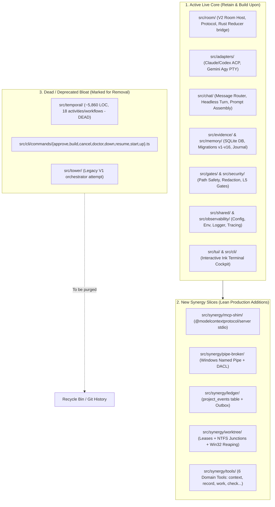

# Zer0 Codebase Architecture Map: Live Core vs. New Synergy Slices vs. Legacy Bloat

- **Date:** 2026-08-14
- **Author:** Gemini (Systems Thinker / Research Powerhouse)
- **Status:** Approved Modular Inventory & Cleanup Plan

---

## 1. Modular Subsystem Map Overview

---

## 2. Detailed Directory Inventory

### 🟢 Category 1: Live Core (What is actively running and required)

| Module / Directory | Purpose & Role | Key Dependencies | Status |
|---|---|---|---|
| `src/room/` | V2 Room engine, multi-agent protocol, permissions, and lifecycle host | `ulid`, `zod`, `better-sqlite3` | **LIVE CORE** |
| `src/adapters/` | Transport adapters: ACP for Claude/Codex, ConPTY for Gemini (`agy`) | `node-pty`, `execa`, `@agentclientprotocol/sdk` | **LIVE CORE** |
| `src/chat/` | Headless turn runner, cockpit prompt builder, address parser (`@all`, `@claude`) | `zod`, `ink` | **LIVE CORE** |
| `src/evidence/` | SQLite database connection, schema migrations (v1–v16) | `better-sqlite3`, `zod` | **LIVE CORE** |
| `src/memory/` | Journal store, verification runner, host evidence capture, reconciler | `better-sqlite3`, `execa` | **LIVE CORE** |
| `src/gates/` | Quality clamps, agent files validator, encoding checks | `biome`, `typescript` | **LIVE CORE** |
| `src/security/` | Path traversal prevention, secret redaction, token isolation | Standard library | **LIVE CORE** |
| `src/shared/` | Central config loader, child environment allowlist, structured logger | Standard library | **LIVE CORE** |
| `src/tui/` | Terminal cockpit rendering | `ink`, `react` | **LIVE CORE** |

---

### 🔵 Category 2: New Synergy Slices (Lean additions to implement)

These are the only net-new files required to bring the Synergy plan to life:

1. `src/synergy/mcp-shim/` — Thin stdio MCP server (`@modelcontextprotocol/server`) forwarding tool calls over named pipe.
2. `src/synergy/pipe-broker/` — Local Windows named pipe broker with current-user DACL and 256-bit token authentication.
3. `src/synergy/ledger/` — `project_events` single-writer queue + transactional outbox table reducer.
4. `src/synergy/worktree/` — Leased Git worktrees with instant NTFS Directory Junctions (`mklink /J node_modules`) and Win32 Job Object process-tree reaping.
5. `src/synergy/tools/` — The 6 domain tools (`zer0_context`, `zer0_record`, `zer0_work`, `zer0_check`, `zer0_receipts`, `zer0_handoff`).

---

### 🔴 Category 3: Dead / Bloat Surface (Targeted for safe elimination)

| Dead Module | LOC | Reason for Deprecation | Migration Action Required Before Delete |
|---|---|---|---|
| `src/temporal/activities/memory-compiler.ts` | 174 | Live `prompt-builder.ts` imports `compileMemory` from here | **Move to `src/memory/memory-compiler.ts`** and update import in `prompt-builder.ts`. |
| `src/temporal/` (Remainder) | ~5,680 | Old V1 distributed workflow pipeline (replaced by local V2 Room Host + SQLite Ledger) | **Delete completely** once `compileMemory` is moved. |
| `src/cli/commands/{approve,build,cancel,doctor,down,resume,start,status,up}.ts` | ~1,200 | Legacy Temporal CLI subcommands | **Remove from CLI router** (V2 uses `zer0 chat` cockpit). |
| `src/tower/` | ~800 | Old orchestrator prototype | **Deprecate & remove**. |
| `package.json` `@temporalio/*` | N/A | Heavy external dependency | **Remove `@temporalio/*` from dependencies & devDependencies**. |

---

## 3. Safe Severance & Cleanup Sequence

To ensure zero regressions while eliminating bloat:

1. **Step 1:** Relocate `src/temporal/activities/memory-compiler.ts` to `src/memory/memory-compiler.ts`. Update `src/chat/prompt-builder.ts` import.
2. **Step 2:** Run `npm test` and `npm run typecheck` to verify the compiler cleanly decouples.
3. **Step 3:** Delete `src/temporal/` directory and legacy V1 CLI command files.
4. **Step 4:** Remove `@temporalio/*` from `package.json` and run `npm install`.
5. **Step 5:** Run `npm run gates` to guarantee 100% green compilation across all quality gates.
