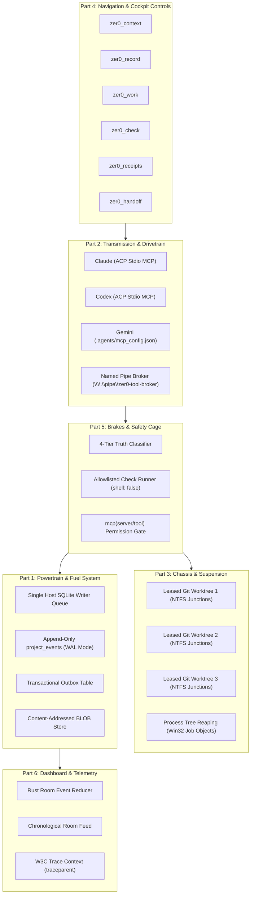
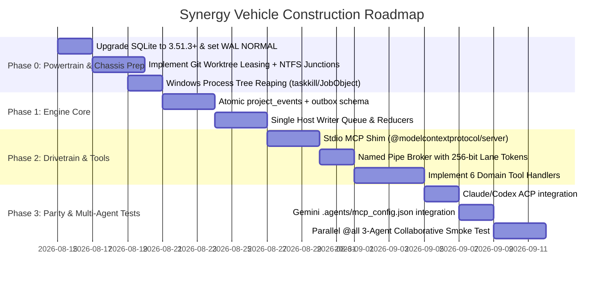

# Zer0 Agent Synergy Architecture: Subsystem Decomposition & Engineering Analysis ("Car Parts" Blueprint)

- **Author:** Gemini (Research Powerhouse / Systems Thinker / Visual Auditor)
- **Date:** 2026-08-14
- **Target System:** Zer0 Multi-Agent Collaborative System (Claude, Codex, Gemini)
- **Status:** Architectural Proposal & Subsystem Specification
- **Decision Context:** Deconstructing the synergy tool architecture into modular, best-in-class components ("car parts") to build a FAANG-grade multi-agent collaboration engine.

---

## 1. The Car Metaphor: System Architecture Overview

A high-performance racecar is not a single monolith; it is an integrated assembly of specialized, precision-engineered subsystems. If the transmission slips, the engine’s power is lost. If the chassis lacks rigidity, the handling collapses. 

In the Zer0 Multi-Agent Architecture, Claude, Codex, and Gemini are the three drivers operating in the same vehicle. To allow them to work concurrently without crashing, corrupting state, or fighting for the steering wheel, we decompose the platform into **six modular subsystems**:



---

## 2. Part 1: The Powertrain (Canonical SQLite Event Ledger & Transactional Outbox)

### Role & Purpose
The powertrain provides the durable energy and state of the system. It guarantees that every note, task claim, check execution, and decision is atomically recorded, immutable, and replayable, with zero data loss across host crashes.

### Industry Gold Standard & Implementation Choices
1. **Event Sourcing + CQRS Pattern:** Every state mutation is appended to `project_events` as an immutable delta. Projections (`work_items`, `knowledge_entries`, `verification_receipts`) are deterministic read-optimized views generated by pure reducers.
   - *Source:* [Martin Fowler: Event Sourcing](https://martinfowler.com/eaaDev/EventSourcing.html) & [Azure Architecture: Event Sourcing Pattern](https://learn.microsoft.com/en-us/azure/architecture/patterns/event-sourcing).
2. **Transactional Outbox Pattern:** In the same `BEGIN IMMEDIATE` database transaction that writes to `project_events`, an entry is committed to `room_outbox`. An asynchronous outbox relay pushes events to the room feed. This eliminates split-brain between database state and UI state.
   - *Source:* [AWS Prescriptive Guidance: Transactional Outbox Pattern](https://docs.aws.amazon.com/prescriptive-guidance/latest/cloud-design-patterns/transactional-outbox.html).
3. **SQLite WAL Concurrency Profile on Windows:**
   - Use `PRAGMA journal_mode = WAL;` and `PRAGMA foreign_keys = ON;`.
   - **Crucial Setting:** Use `PRAGMA synchronous = NORMAL;`. In WAL mode, `NORMAL` guarantees 100% ACID durability across application crashes and power loss without forcing an expensive synchronous NTFS disk flush on every commit (which `FULL` imposes, adding 15–30ms per tool write).
   - Single dedicated writer connection managed via an async in-memory FIFO queue to completely avoid `SQLITE_BUSY` contention.
   - *Source:* [SQLite Write-Ahead Logging](https://sqlite.org/wal.html) & [SQLite Synchronous Pragma](https://sqlite.org/pragma.html#pragma_synchronous).
4. **Hybrid Payload Storage (Content-Addressed Blobs):** Large check outputs, diffs, and AST dumps are written to disk as SHA-256 hashed files, with atomic file renames, before committing the SQLite transaction pointing to `payload_blob_hash`.

---

## 3. Part 2: The Transmission & Drivetrain (Unified Stdio MCP Transport & Named Pipe Broker)

### Role & Purpose
The transmission transfers power from the models to the engine without gear grinding. It ensures Claude, Codex, and Gemini have **100% semantic and transport parity** through standard Model Context Protocol (MCP) mechanisms.

### Key Breakthrough: Transport Unification
Previous drafts assumed Gemini required a custom CLI wrapper. However, Antigravity (`agy`) natively supports **stdio MCP servers** via `.agents/mcp_config.json` inside the workspace root.

```
+-------------------------------------------------------------------------+
|                       UNIFIED TRANSPORT MATRIX                          |
+-------------------+-----------------------------------------------------+
| Agent             | Discovery & Injection Seam                          |
+-------------------+-----------------------------------------------------+
| Claude (Claude 5) | ACP session/new -> mcpServers stdio descriptor      |
| Codex (GPT-5)     | ACP session/new -> mcpServers stdio descriptor      |
| Gemini (3.7 Flash)| Host-written .agents/mcp_config.json in worktree   |
+-------------------+-----------------------------------------------------+
```

### Industry Gold Standard & Implementation Choices
1. **Official TypeScript MCP SDK v2 (`@modelcontextprotocol/server`):**
   - Implements the **2026-07-28 MCP specification**.
   - Standard Schema support for tool parameter validation (Zod v4).
   - *Source:* [MCP 2026-07-28 Specification](https://github.com/modelcontextprotocol/typescript-sdk) & [npm: @modelcontextprotocol/server](https://www.npmjs.com/package/@modelcontextprotocol/server).
2. **Local Windows Named Pipe Broker:**
   - Shims run as thin subprocesses that forward tool calls over Windows Named Pipes (`\\.\pipe\zer0-tool-broker-<session_uuid>`).
   - Authenticated via single-use 256-bit cryptographically secure host-minted lane tokens passed via environment variables.
   - Secured with Windows Discretionary Access Control Lists (DACL) restricting connection to the current user SID only.
   - *Source:* [Microsoft Docs: Named Pipe Security and Access Rights](https://learn.microsoft.com/en-us/windows/win32/ipc/named-pipe-security-and-access-rights).

---

## 4. Part 3: The Chassis & Suspension (Worktree Isolation, NTFS Junctions & Windows Process Sandboxing)

### Role & Purpose
The chassis provides structural rigidity. When multiple agents write code simultaneously, the chassis prevents them from corrupting each other's git checkouts, locking the repository index, or leaving orphaned processes behind.

### Industry Gold Standard & Implementation Choices
1. **Isolated Git Worktrees per Write-Capable Lane:**
   - Each active write turn creates a leased worktree at `.zer0/worktrees/lane-<lane_id>` branched from an immutable base commit.
   - *Source:* [Git Worktree Documentation](https://git-scm.com/docs/git-worktree.html).
2. **Fast Dependency Sharing via NTFS Directory Junctions:**
   - Creating a worktree does not clone `node_modules`. Running `npm install` per worktree is an unacceptable performance bottleneck.
   - *FAANG Solution:* The host immediately creates an NTFS Directory Junction (`mklink /J node_modules ...`) pointing to the root workspace `node_modules`. This provides instant sub-millisecond dependency resolution with zero disk overhead.
   - *Source:* [Microsoft Docs: Hard Links and Junctions](https://learn.microsoft.com/en-us/windows/win32/fileio/hard-links-and-junctions).
3. **Lock Contention Mitigation (`GIT_OPTIONAL_LOCKS=0`):**
   - Background status checks run with `GIT_OPTIONAL_LOCKS=0` to prevent background watchers from generating transient `index.lock` collisions.
   - *Source:* [Git Environment Variables](https://git-scm.com/docs/git#Documentation/git.txt-codeGITOPTIONALLOCKScode).
4. **Windows Process-Tree Reaping:**
   - On Windows, `child_process.kill()` fails to terminate subprocess trees (e.g. `npm test` spawning child test runners), leaving file locks open that cause `git worktree remove` to fail with `EBUSY`/`EPERM`.
   - *FAANG Solution:* All spawned check processes and MCP shims are bound to a Win32 Job Object with `JOB_OBJECT_LIMIT_KILL_ON_JOB_CLOSE`, or reaped using `taskkill /F /T /PID <pid>`.
   - *Source:* [Microsoft Docs: Job Objects](https://learn.microsoft.com/en-us/windows/win32/procthread/job-objects).
5. **Credential Protection via `.git/info/exclude`:**
   - The lane-specific `.agents/mcp_config.json` containing the lane token is excluded locally via `.git/info/exclude` rather than `.gitignore` to prevent credential leakage into git history or pull requests.

---

## 5. Part 4: The Navigation & Cockpit Controls (The 6 Domain Tools & Context Compaction)

### Role & Purpose
The cockpit provides the steering wheel and pedals. The tools must be concise, expressive, strictly bounded, and economical in token usage.

### The 6 Core Synergy Tools

| Tool Name | Type | Purpose | Approval | Output |
|---|---|---|---|---|
| `zer0_context` | Read | Fetch active project goals, child tasks, notes, active leases, and receipts | Automatic | Bounded JSON (max 1500 tokens) |
| `zer0_record` | Write | Record observations, hypotheses, and decision proposals | Automatic | Event ID + project sequence |
| `zer0_work` | Read/Write | Decompose tasks, claim child work, update progress, release leases | Automatic (within grant) | Work item status + revision |
| `zer0_check` | Exec | Request execution of pre-configured tests, lint, or builds | Policy-gated | Pending receipt ID |
| `zer0_receipts` | Read | Query machine-observed verification outcomes and git diffs | Automatic | Structured verification record |
| `zer0_handoff` | Action | Request a single visible, read-only consultation from a peer agent | Automatic (1-hop max) | Hop dispatch event |

### Industry Gold Standard: Semantic Context Compaction
- Unbounded tool contexts quickly starve LLM context windows.
- The `zer0_context` reducer applies **deterministic compaction**:
  1. Superseded notes and obsolete proposals are pruned.
  2. Closed tasks are folded into single-line milestone summaries.
  3. Git status is truncated to modified file paths and tree hashes.
  4. Response is strictly capped to a 1500-token budget.
- *Source:* [MCP Client Best Practices](https://modelcontextprotocol.io/docs/2026-07-28/develop/clients/client-best-practices).

---

## 6. Part 5: The Brakes & Safety Cage (4-Tier Truth Separation & Process Execution Guardrails)

### Role & Purpose
The safety system protects the vehicle and drivers from collisions, hallucinations, and malicious code execution (prompt injection).

### The 4-Tier Truth Invariant
Zer0 mechanically enforces four distinct truth tiers:

```
+-------------------------------------------------------------------------+
|                          TRUTH HIERARCHY                                |
+----------------------+--------------------+-----------------------------+
| Class                | Source             | Authoritative Authority?    |
+----------------------+--------------------+-----------------------------+
| Agent Assertion      | LLM Text / Tool    | NEVER (Unverified Claim)    |
| Host Observation     | Machine Exit Code  | YES (Observed Reality)      |
| Operator Decision    | User Explicit      | YES (Within Defined Scope)  |
| Derived Projection   | Pure Reducer       | NO (Recomputable View)      |
+----------------------+--------------------+-----------------------------+
```

### Safety Rules & Execution Guardrails
1. **No Self-Certification:** An agent can never emit `status: "passed"` or `verified: true`. Only `zer0_check` host execution can mark a check as passed.
2. **Allowlisted Execution (`shell: false`):** The check runner executes predefined binaries directly with `shell: false`, bounded memory limits, wall-clock timeouts (e.g. 60s), and sanitized environment variables. Arbitrary shell strings from model text are rejected.
3. **Defense-in-Depth Native Permissions:** In addition to host-level validation, Antigravity's native `mcp(server/tool)` permissions pre-authorize read tools (`zer0_context`, `zer0_receipts`) while gating destructive actions.
   - *Source:* [OWASP Top 10 for LLM Applications: Insecure Output Handling](https://owasp.org/www-project-top-10-for-large-language-model-applications/).

---

## 7. Part 6: The Dashboard & Telemetry (Rust Reducer, Chronological Feed & W3C Distributed Tracing)

### Role & Purpose
The dashboard gives the operator real-time visibility into what the agents are doing, with millisecond-level precision, zero UI stutter, and full trace correlation.

### Industry Gold Standard & Implementation Choices
1. **W3C Distributed Tracing (`traceparent`):**
   - Every operator turn initializes a 128-bit W3C Trace ID.
   - Every agent lane, tool invocation, named pipe message, check execution, and outbox delivery propagates this context using standard W3C `traceparent` headers.
   - *Source:* [W3C Trace Context Specification](https://www.w3.org/TR/trace-context/) & [OpenTelemetry Tracing API](https://opentelemetry.io/docs/specs/otel/trace/api/).
2. **Rust State Reducer:**
   - The Rust room protocol engine consumes outbox events as a stream of immutable diffs.
   - Deduplication is guaranteed using `event_id` and `idempotency_key`.
   - The UI feed displays routine context reads as compact foldable chips, while highlighting major state transitions (work claimed, check failed, handoff dispatched).

---

## 8. Assembly Plan & Phased Construction Sequence

To build this car efficiently without regressions, we follow an incremental 5-phase manufacturing order:



---

## 9. Conclusion

By treating our architecture like a finely tuned vehicle—unifying the transmission via stdio MCP, reinforcing the chassis with NTFS junctions and process tree reaping, calibrating the powertrain with SQLite WAL `synchronous = NORMAL`, and safeguarding the cockpit with 4-tier truth separation—we create a **true FAANG-grade collaboration platform** where Claude, Codex, and Gemini operate as an unstoppable engineering team.
